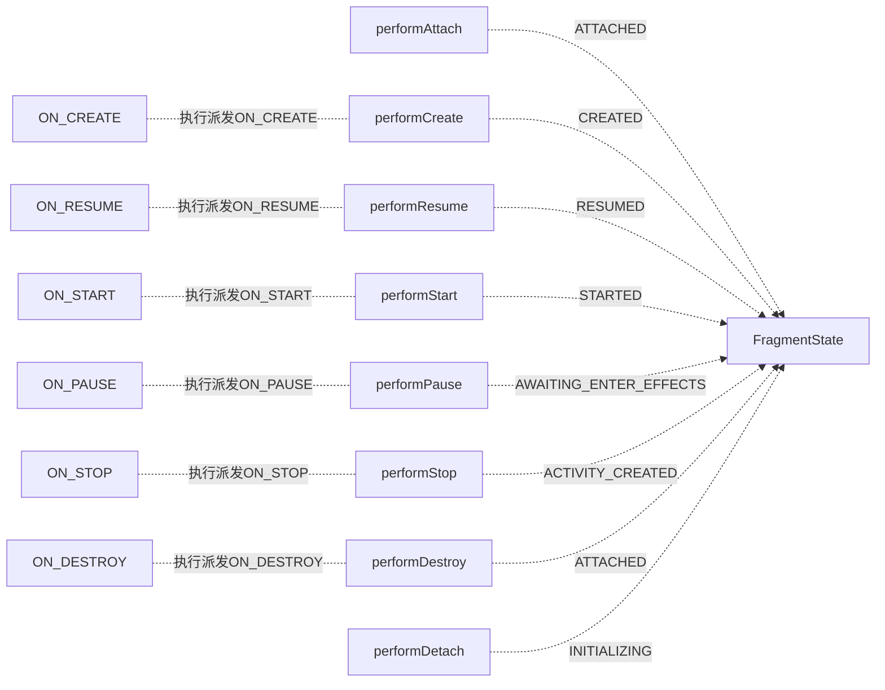

[TOC]


# Lifecycle原理和机制

**Lifectcle**的用来感知页面的生命周期，并通过利用观察者模式，将感知到的生命周期告知到相应的回调中去。

## ComponentActivity中的实现探讨

在**ComponentActivity**首先实现了**LifecycleOwner**接口并返回**LifecycleRegistry**对象

```java
public class ComponentActivity extends androidx.core.app.ComponentActivity implements
        ContextAware,
        LifecycleOwner,
        ViewModelStoreOwner,
        HasDefaultViewModelProviderFactory,
        SavedStateRegistryOwner,
        OnBackPressedDispatcherOwner,
        ActivityResultRegistryOwner,
        ActivityResultCaller {

    private final LifecycleRegistry mLifecycleRegistry = new LifecycleRegistry(this);
    
    public Lifecycle getLifecycle() {
        return mLifecycleRegistry;
    }        
 }
```

### 生命周期的感知与传递

 为什么说**ComponentActivity**已经实现好生命周期观察派发，其实在它执行**onCreate**的生命周期时，其内部会添加一个**ReportFragment**，接下来请查看部分源码：

```java
    @Override
    protected void onCreate(@Nullable Bundle savedInstanceState) {
        mSavedStateRegistryController.performRestore(savedInstanceState);
        
        mContextAwareHelper.dispatchOnContextAvailable(this);
        super.onCreate(savedInstanceState);
        //在这里调用 ReportFragment.injectIfNeededIn 静态方法 动态添加一个ReportFragment
        ReportFragment.injectIfNeededIn(this);
        if (mContentLayoutId != 0) {
            setContentView(mContentLayoutId);
        }
    }
    
    public static void injectIfNeededIn(Activity activity) {
        if (Build.VERSION.SDK_INT >= 29) {
            // On API 29+, we can register for the correct Lifecycle callbacks directly
            LifecycleCallbacks.registerIn(activity);
        }
        // Prior to API 29 and to maintain compatibility with older versions of
        // ProcessLifecycleOwner (which may not be updated when lifecycle-runtime is updated and
        // need to support activities that don't extend from FragmentActivity from support lib),
        // use a framework fragment to get the correct timing of Lifecycle events
        android.app.FragmentManager manager = activity.getFragmentManager();
        if (manager.findFragmentByTag(REPORT_FRAGMENT_TAG) == null) {
            manager.beginTransaction().add(new ReportFragment(), REPORT_FRAGMENT_TAG).commit();
            // Hopefully, we are the first to make a transaction.
            manager.executePendingTransactions();
        }
    }
```

其实在**ReportFragment**最为核心的在于两个地方：静态内部类**LifecycleCallbacks**、静态方法**dispatch**,

其中**LifecycleCallbacks**中在高于29以上版本中它通过实现了**ActivityLifecycleCallbacks**这个接口，通过回调及时的调用**dispatch**方法将相应的**Activity**中的生命周期及时的派发出去

```java
    @RequiresApi(29)
    static class LifecycleCallbacks implements Application.ActivityLifecycleCallbacks {

        static void registerIn(Activity activity) {
            activity.registerActivityLifecycleCallbacks(new LifecycleCallbacks());
        }

        @Override
        public void onActivityPostCreated(@NonNull Activity activity,
                @Nullable Bundle savedInstanceState) {
            dispatch(activity, Lifecycle.Event.ON_CREATE);
        }

        @Override
        public void onActivityPostStarted(@NonNull Activity activity) {
            dispatch(activity, Lifecycle.Event.ON_START);
        }


        @Override
        public void onActivityPostResumed(@NonNull Activity activity) {
            dispatch(activity, Lifecycle.Event.ON_RESUME);
        }

        @Override
        public void onActivityPrePaused(@NonNull Activity activity) {
            dispatch(activity, Lifecycle.Event.ON_PAUSE);
        }


        @Override
        public void onActivityPreStopped(@NonNull Activity activity) {
            dispatch(activity, Lifecycle.Event.ON_STOP);
        }


        @Override
        public void onActivityPreDestroyed(@NonNull Activity activity) {
            dispatch(activity, Lifecycle.Event.ON_DESTROY);
        }
    }

```

那么我们来看看**ReportFragment**中的**dispatch**是如何实现事件的派发

```java
    static void dispatch(@NonNull Activity activity, @NonNull Lifecycle.Event event) {
        if (activity instanceof LifecycleRegistryOwner) {
            ((LifecycleRegistryOwner) activity).getLifecycle().handleLifecycleEvent(event);
            return;
        }

        if (activity instanceof LifecycleOwner) {
            Lifecycle lifecycle = ((LifecycleOwner) activity).getLifecycle();
            if (lifecycle instanceof LifecycleRegistry) {
                ((LifecycleRegistry) lifecycle).handleLifecycleEvent(event);
            }
        }
    }

    public void handleLifecycleEvent(@NonNull Lifecycle.Event event) {
   		enforceMainThreadIfNeeded("handleLifecycleEvent");
   		moveToState(event.getTargetState());
	}
     public State getTargetState() {
		switch (this) {
			case ON_CREATE:
			case ON_STOP:
                 return State.CREATED;
			case ON_START:
			case ON_PAUSE:
                 return State.STARTED;
			case ON_RESUME:
                 return State.RESUMED;
			case ON_DESTROY:
                 return State.DESTROYED;
			case ON_ANY:
                 break;
            }
            throw new IllegalArgumentException(this + " has no target state");
        }
    }
```

其实这里**State**是一个状态机的机制。

其实**State**他是一个有序的状态关系页面从创建到可见，从不可见到回收的这样一个机制。

请看下图（按照官方推荐绘制的时序图）

```mermaid
sequenceDiagram
participant INITIALIZED 
participant DESTOYRD as dead State
participant CREATE  
participant STARTED 
participant RESUMED 

Note left of INITIALIZED :Events

INITIALIZED 	->> 		CREATE 		: 	ON_CREATED
CREATE 			-->>     	STARTED 	: 	ON_STARTED
STARTED 		-->> 		RESUMED 	: 	ON_RESUMED
RESUMED		 	-->> 		STARTED 	: 	ON_PAUSE
STARTED		 	-->> 		CREATE 		: 	ON_STOP
CREATE 			-->>     	DESTOYRD 	: 	ON_DESTOYRD

```

重点关注下**moveState**方法

```java
    private void moveToState(State next) {
        if (mState == next) {
            return;
        }
        if (mState == INITIALIZED && next == DESTROYED) {
            throw new IllegalStateException("no event down from " + mState);
        }
        mState = next;
        if (mHandlingEvent || mAddingObserverCounter != 0) {
            mNewEventOccurred = true;
            // we will figure out what to do on upper level.
            return;
        }
        mHandlingEvent = true;
        //这里做了一个同步方法
        sync();
        mHandlingEvent = false;
        if (mState == DESTROYED) {
            mObserverMap = new FastSafeIterableMap<>();
        }
    }
private void sync() {
    LifecycleOwner lifecycleOwner = mLifecycleOwner.get();
    ...... 
    while (!isSynced()) {
        mNewEventOccurred = false;
        if (mState.compareTo(mObserverMap.eldest().getValue().mState) < 0) {
            backwardPass(lifecycleOwner);
        }
        Map.Entry<LifecycleObserver, ObserverWithState> newest = mObserverMap.newest();
        if (!mNewEventOccurred && newest != null
                && mState.compareTo(newest.getValue().mState) > 0) {
            forwardPass(lifecycleOwner);
        }
    }
    mNewEventOccurred = false;
}
```

通过状态机获取当前的状态之后，会将当前状态进行记录，然后会 执行 sync()  方法进行同步操作。

在这里会通过当前状态和存储的状态进行比较操作，判断当然流程 是 向正在可见发展 还是 正在向不可见发展。

例如当前执行的状态是**START**，与上个状态相比，如果上个状态是**CREATE**，相比结果就是>0 ，说明是正在可见；如果上个状态是**RESUME** ，相比结果<0 ，说明是正在不可见。

**backwardPass**  和 **forwardPass** 主要有两点不同：

1. 在对**mObserverMap** 存储的状态进行遍历时，**backwardPass** 是以 栈的形式遍历，**forwardPass**是以队列的形式遍历。

2. 对状态还原的时候，**backwardPass** 是不可见方向还原，，**forwardPass** 是以可见方向还原

最后是通过**ObserverWithState** 的 **dispatchEvent** 方法 进行了分发

## Fragment中的实现探讨

其实在**Fragmen**构造方法中一早就实现了对**LifecycleRegistry**的实现，而且**Fragment**也是实现了**LifecycleOwner**

```java
    public Fragment() {
        initLifecycle();
    }

    private void initLifecycle() {
        mLifecycleRegistry = new LifecycleRegistry(this);
        mSavedStateRegistryController = SavedStateRegistryController.create(this);
        // The default factory depends on the SavedStateRegistry so it
        // needs to be reset when the SavedStateRegistry is reset
        mDefaultFactory = null;
    }
```

### Fragment中的生命周期事件派发

在**Fragment**中生命事件的派发主要是由其对应的方法进行派发，并且同时在相应方法修改当前的**Fragment**的状态值。



在上述图中我们可以得出其实**FragmentState**的状态变化是符合在**Activity**中的**State**变化的时序图

### 为什么建议使用FragmentViewLifecycleOwner去与LiveData进行绑定

譬如在**Fragment**中我们常常在**onViewCreated**去对**ViewModel**的中**LiveData**订阅绑定，这时候如果使用的**Fragment**本身去订阅绑定**容易触发重复订阅BUG**，为什么呢？原因在于如果当前**Fragment**在堆栈中并没有出栈，而是由于**Fragment**间进行反复跳转替换。往往都会容易反复触发**onViewCreated**，而且此刻**Fragment**由于一直没有执行过**Destroy**方法，其内部的反解绑一直没有执行。所以就会导致**重复订阅的BUG**

## ObserverWithState 探讨

在上面两大节描述了**ComponentActivity、Fragment**中是如何利用**LifecycleRegistry**实现生命周期的派发。这里其实还要探讨下**ObserverWithState**这个类，这个类主要用于 将**LifecycleObserver** 和**状态**进行包装，然后其内部去实现生命周期的发送，告知到我们。

接下来分析源码：

```java
    @Override
    public void addObserver(@NonNull LifecycleObserver observer) {
        enforceMainThreadIfNeeded("addObserver");
        
        State initialState = mState == DESTROYED ? DESTROYED : INITIALIZED;
        //通过ObserverWithState将观察者和状态进行包装
        ObserverWithState statefulObserver = new ObserverWithState(observer, initialState);
        //将包装类放到 FastSafeIterableMap<LifecycleObserver, ObserverWithState> 中 。
        ObserverWithState previous = mObserverMap.putIfAbsent(observer, statefulObserver);
		//核心对齐当前状态
        while ((statefulObserver.mState.compareTo(targetState) < 0
                && mObserverMap.contains(observer))) {
            pushParentState(statefulObserver.mState);
            final Event event = Event.upFrom(statefulObserver.mState);
            if (event == null) {
                throw new IllegalStateException("no event up from " + statefulObserver.mState);
            }
            //这里统一状态的分发
            statefulObserver.dispatchEvent(lifecycleOwner, event);
            popParentState();
            // mState / subling may have been changed recalculate
            targetState = calculateTargetState(observer);
        }

        if (!isReentrance) {
            // we do sync only on the top level.
            sync();
        }
        
    }
```

使用 **ObserverWithState**类 将观察者对象和状态进行包装，然后存储在 **FastSafeIterableMap** 中。

**FastSafeIterableMap** 具有以下特性：

- 支持键值对存储，用链表实现，模拟成Map的接口。

- 支持在遍历的过程中删除任意元素，不会触发**ConcurrentModifiedException**。
- 非线程安全。

注释中提到的将状态进行对齐，是在添加观察者的时候，可能是在任何状态的时候进行添加的，**lifecycle**需要将这个状态进行对齐。

例如我们在**onResume**的回调中添加了观察者，此时我们的观察者就收到依次收到 **onCreate**， **onStart**，**onResume**的回调。

接下来我们分析其**ObserverWithState**内部核心源码。

~~~java
    static class ObserverWithState {
        State mState;
        LifecycleEventObserver mLifecycleObserver;

        ObserverWithState(LifecycleObserver observer, State initialState) {
            mLifecycleObserver = Lifecycling.lifecycleEventObserver(observer);
            mState = initialState;
        }

        void dispatchEvent(LifecycleOwner owner, Event event) {
            State newState = event.getTargetState();
            mState = min(mState, newState);
            mLifecycleObserver.onStateChanged(owner, event);
            mState = newState;
        }
    }
~~~

在上图中再次得出**ObserverWithState**构建是由**LifecycleObserver**以及**State**去构造出来。而在其内部使用了**LifecycleEventObserver**，而在**ObserverWithState**的**dispath**方法中**LifecycleEventObserver**将页面中的状态变化告知我们，接下来我探讨下**LifecycleEventObserver**作用。

```java
    static LifecycleEventObserver lifecycleEventObserver(Object object) {
        boolean isLifecycleEventObserver = object instanceof LifecycleEventObserver;
        boolean isFullLifecycleObserver = object instanceof FullLifecycleObserver;
        if (isLifecycleEventObserver && isFullLifecycleObserver) {
            return new FullLifecycleObserverAdapter((FullLifecycleObserver) object,
                    (LifecycleEventObserver) object);
        }
        if (isFullLifecycleObserver) {
            return new FullLifecycleObserverAdapter((FullLifecycleObserver) object, null);
        }
}
```

其实在l**ifecycleEventObserver**方法中目的是返回**FullLifecycleObserverAdapter**一个观察者适配器对象。其目的就是做观测页面的生命周期及时的告知给我们。

## 总结

1. 要区分**ComponentActivity**与**Fragment**的生命周期的实现区别，**ComponentActivity**是在**OnCreate**的生命周期通过创建并添加**ReportFragment**去做生命周期的感知以及派发，而**Fragment**是直接实现通过其内部的对应的方法及时的将生命周期状态去做感知派发。
2. 要掌握状态器的状态变化，其变化在页面可见时刻与不可见时刻的区别
3. 为什么基于继承的**ComponentActivity**与**LiveData**可以直接订阅，而**Fragment**推荐使用**FragmentViewLifecycleOwner**其中就是为了**避免重复订阅的BUG**
4. 在分发过程中，**Lifecycle** 通过内部维护的状态机 将生命周期事件转化为**State**状态，并进行存储，在 分发过程中，通过状态比较来判断 当前过程是正在可见还是正在不可见，不同过程采用不同策略。最后通过调用 **LifecycleEventObserver** 的 **onStateChanged** 方法 来进行回调


