[TOC]

# 常见设计模式知识总结

## 创建型模式

### 工厂模式

核心思想在于，利用抽象接口描述一个抽象的事物，然后有不同的实例去继承实现它。工厂则负责将根据调用者的使用情况创建相应的实例。

可以参考下图：

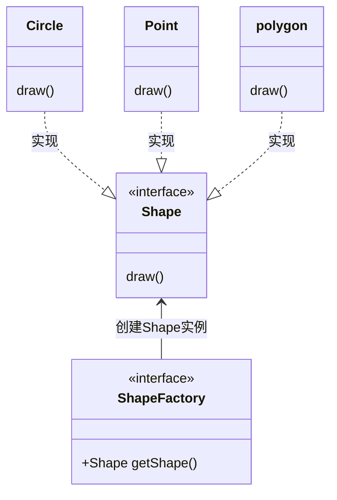

**优点**：在于调用者仅仅关心抽象接口描述即可以，不需要关心其内部实现，调用相应的工厂即可。每次新增一个具体实现实例，拓展工厂类即可。

**缺点**：每次新增一个具体实例都需要拓展工厂类，会使项目中类的个数增加，增加项目对具体类的依赖。

**使用场景**：

1. 日志记录器：记录可能记录到本地硬盘、系统事件、远程服务器等，用户可以选择记录日志到什么地方。
2. 数据库访问，当用户不知道最后系统采用哪一类数据库，以及数据库可能有变化时。
3. 譬如硬件升级模式的抽象，根据实际设备类型创建对相应的硬件升级。

注意：

相对简单情况下，就尽量不要引入工厂模式，工厂模式的目的在于，通过运用抽象的思维将通用性的东西组合成一个抽象的业务对象，然后在根据创建出相应实例。最后在通过相应的工厂实例创建出符合当下场景的产品对象去解决当下的业务需求。

### 抽象工厂模式

**抽象工厂模式**：可以将它理解成为一个**超级抽象工厂**，也就是一个**工厂组合体**，它通过内部符合当下的业务创建构建获取相应的工厂实例，然后生产相应产品解决需求。简短来说 假设有A、B、C三大类通用产品的不同工厂商，其中这些厂商通过合作的关系跟一个**Supper**工厂进行代理合作，但是**Supper**根据不同的客户需求，选择相应的其内部相应的工厂厂商去生产相应的产品解决客户需求。

参考下图：
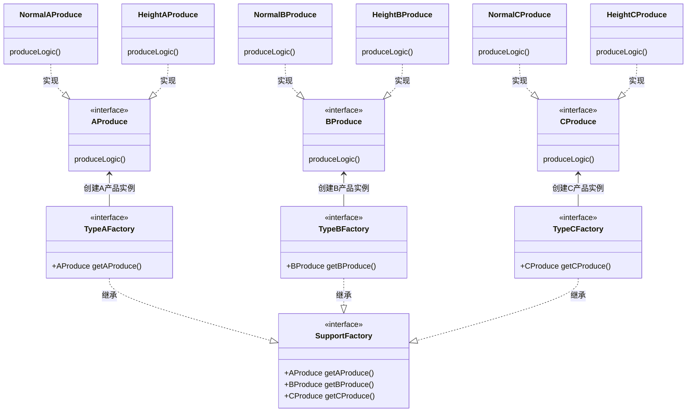

**优点**：当一个产品族中的多个对象被设计成一起工作时，它能保证客户端始终只使用同一个产品族中的对象。

**缺点**：产品族扩展非常困难，要增加一个系列的某一产品，既要在抽象的 Creator 里加代码，又要在具体的里面加代码。

**使用**场景： 1、QQ 换皮肤，一整套一起换。 2、生成不同操作系统的程序。

**注意事项**：产品族难扩展，产品等级易扩展。

### 单例模式

单例模式：主要用于全局单一实例的一种设计模式，主要用来保证全局访问使用时仅仅使用唯一对象。

**优点：**

- 在内存里只有一个实例，减少了内存的开销，尤其是频繁的创建和销毁实例（比如管理学院首页页面缓存）。
- 避免对资源的多重占用（比如写文件操作）。

**缺点：**没有接口，不能继承，与单一职责原则冲突，一个类应该只关心内部逻辑，而不关心外面怎么样来实例化。

### **Builder**模式

**Builder**模式主要在于，在构建实例对象前，通过设置不同的技术细节，让实例创建出来那一刻具有设置的技术细节。

**应用实例：** 

1、去肯德基，汉堡、可乐、薯条、炸鸡翅等是不变的，而其组合是经常变化的，生成出所谓的"套餐"。

**优点：** 1、建造者独立，易扩展。 2、便于控制细节风险。

**缺点：** 1、产品必须有共同点，范围有限制。 2、如内部变化复杂，会有很多的建造类。

**使用场景：** 1、需要生成的对象具有复杂的内部结构。 2、需要生成的对象内部属性本身相互依赖。

**注意事项：**与工厂模式的区别是：建造者模式更加关注与零件装配的顺序。

例如下面这段伪代码

```kotlin
val netClientBudilder :NewClientBuilder = NewClient.newBuilder()

val netClient : NewClient = netClientBudilder
							.setConnectTimeOut()
							.setReadTimeOut()
							.setNetIntercerptor()
							.buid()
```

### 原型模式

解决创建重复对象的需求、并保证性能。它提供了一种创建对象的最佳方式。

这种模式是实现了一个原型接口，该接口用于创建当前对象的克隆。当直接创建对象的代价比较大时，则采用这种模式。例如，一个对象需要在一个高代价的数据库操作之后被创建。我们可以缓存该对象，在下一个请求时返回它的克隆，在需要的时候更新数据库，以此来减少数据库调用。

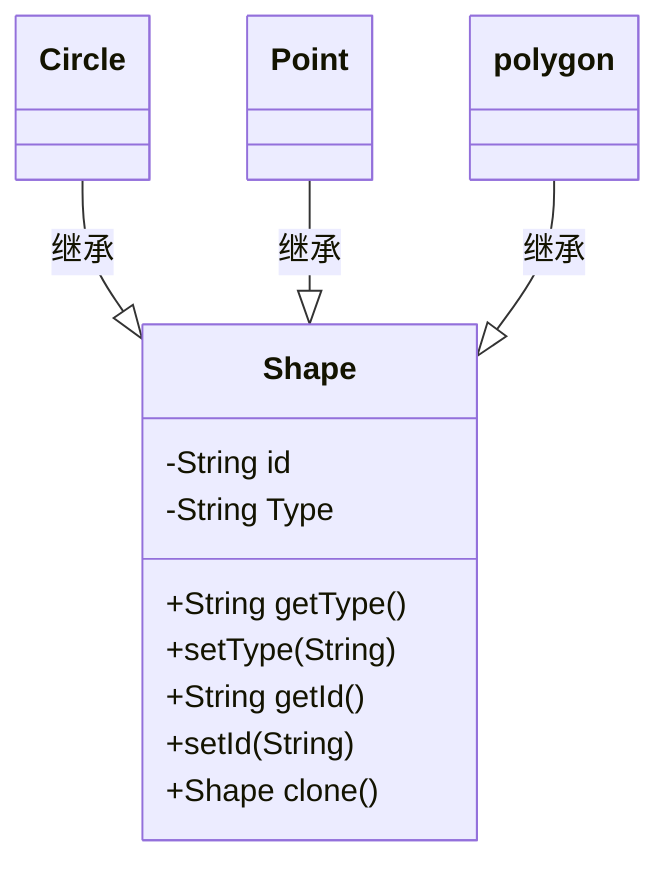

关键代码： 

1. 实现克隆操作，在 JAVA 实现 Cloneable 接口，重写 clone()，在 .NET 中可以使用 Object 类的 MemberwiseClone() 方法来实现对象的浅拷贝或通过序列化的方式来实现深拷贝。 
2. 原型模式同样用于隔离类对象的使用者和具体类型（易变类）之间的耦合关系，它同样要求这些"易变类"拥有稳定的接口。

应用实例： 

- 细胞分裂。 
- JAVA 中的 Object clone() 方法。

优点： 

- 性能提高。 

- 逃避构造函数的约束。

缺点： 

- 配备克隆方法需要对类的功能进行通盘考虑，这对于全新的类不是很难，但对于已有的类不一定很容易，特别当一个类引用不支持串行化的间接对象，或者引用含有循环结构的时候。 
- 必须实现 Cloneable 接口。

使用场景： 

- 资源优化场景。 

- 类初始化需要消化非常多的资源，这个资源包括数据、硬件资源等。 

- 性能和安全要求的场景。

- 通过 new 产生一个对象需要非常繁琐的数据准备或访问权限，则可以使用原型模式。 

- 一个对象多个修改者的场景。 

- 一个对象需要提供给其他对象访问，而且各个调用者可能都需要修改其值时，可以考虑使用原型模式拷贝多个对象供调用者使用。 
- 在实际项目中，原型模式很少单独出现，一般是和工厂方法模式一起出现，通过 clone 的方法创建一个对象，然后由工厂方法提供给调用者。原型模式已经与 Java 融为浑然一体，大家可以随手拿来使用。

注意事项：与通过对一个类进行实例化来构造新对象不同的是，原型模式是通过拷贝一个现有对象生成新对象的。浅拷贝实现 Cloneable，重写，深拷贝是通过实现 Serializable 读取二进制流。

## 结构型模式

### 适配器模式

适配模式简单来说，就是将不兼容的功能，通过一个适配器使得它变为兼容。提供程序的兼容性。譬如，中国与美国电器存在电压标准不一致的情况，那么就需要一个适配器进行转化，使得中国的电器可以在美国使用，美国的电器也能在中国使用。

参考下图

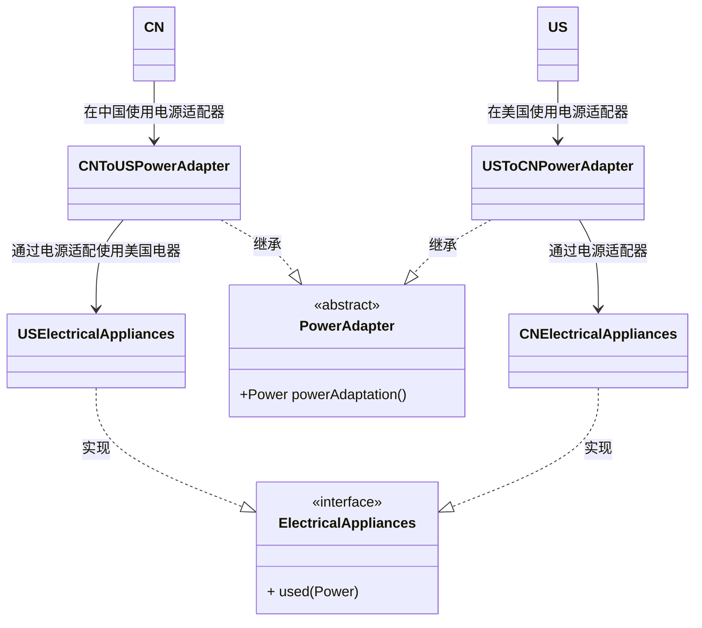

**优点：** 

- 可以让任何两个没有关联的类一起运行。
-  提高了类的复用。 
- 增加了类的透明度。 
- 灵活性好。

**缺点：** 

- 过多地使用适配器，会让系统非常零乱，不易整体进行把握。比如，明明看到调用的是A接口，其实内部被适配成了B接口的实现，一个系统如果太多出现这种情况，无异于一场灾难。因此如果不是很有必要，可以不使用适配器，而是直接对系统进行重构。 2.由于 JAVA 至多继承一个类，所以至多只能适配一个适配者类，而且目标类必须是抽象类。

**使用场景：**有动机地修改一个正常运行的系统的接口，这时应该考虑使用适配器模式。

**注意事项：**适配器的初衷就是用来维护项目的版本迭代，兼容旧功能所诞生的设计模式。

### 装饰器模式

允许向一个现有的对象添加新的功能，同时又不改变其结构。这种类型的设计模式属于结构型模式，它是作为现有的类的一个包装。

参考下图:

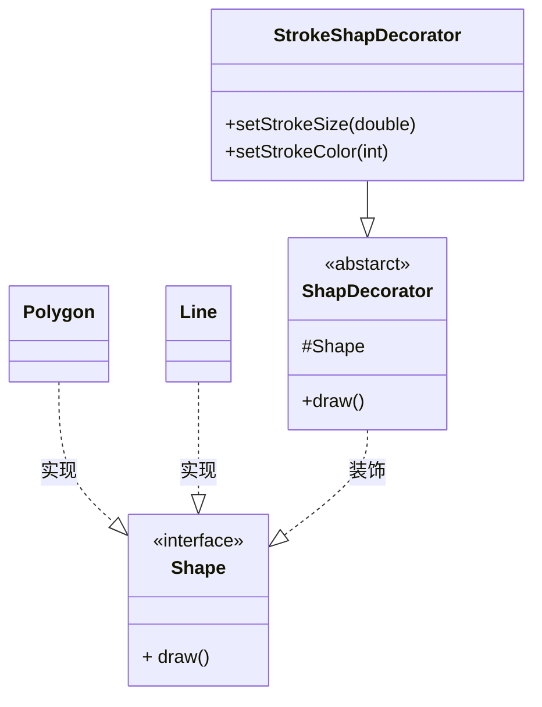
**优点**：装饰类和被装饰类可以独立发展，不会相互耦合，装饰模式是继承的一个替代模式，装饰模式可以动态扩展一个实现类的功能。

**缺点**：多层装饰比较复杂。

**使用场景**： 

- 扩展一个类的功能。
- 动态增加功能，动态撤销。

**注意事项**：可代替继承。

示例代码加深理解：
```kotlin
interface Shape{
    draw()
}

class Line : Shape{
    
    override draw(){
        print("line draw")
    }
}

class Polygon : Shape{
    
    override draw(){
        print("Polygon draw")
    }
}

abstract class ShapeDecorator(protected var decoratedShape:Shape) implements Shape {
   
   open fun draw(){
      decoratedShape.draw();
   }  
}

public class StrokeShapDecorator(currentShape:Shape) : ShapeDecorator(currentShape) {
 
  var StrokeSize:Double? = null 
  fun setStrokeSize(size:double){ strokeSize = size}
  var strokeColor:Int = Color.transparent  
  fun setStrokeColor(int){ strokeCOlor = color }
 
   override fun draw() {
      decoratedShape.draw();         
      println("StrokeSize:$StrokeSize")
      println("setStrokeColor:$setStrokeColor")
   }
 
}
```

### 代理模式

代理模式可以这样子理解，一个抽象对象对外暴露的功能，被另外一个代理对象进行包装控制，并暴露其相同的对外功能，外部通过使用其代理对象对该抽象对象进行控制。

**优点：** 

- 职责清晰。 

- 高扩展性。 

- 智能化。

**缺点**

- 由于在客户端和真实主题之间增加了代理对象，因此有些类型的代理模式可能会造成请求的处理速度变慢。
- 实现代理模式需要额外的工作，有些代理模式的实现非常复杂。

**使用场景：**按职责来划分，通常有以下使用场景：

| 远程代理   | 虚拟代理 | 复制写入代理 | 缓存代理     |
| ---------- | -------- | ------------ | ------------ |
| 防火墙代理 | 同步代理 | 保护代理     | 智能引用代理 |

**注意事项：**

- 和适配器模式的区别：适配器模式主要改变所考虑对象的接口，而代理模式不能改变所代理类的接口。 
- 和装饰器模式的区别：装饰器模式为了增强功能，而代理模式是为了加以控制。


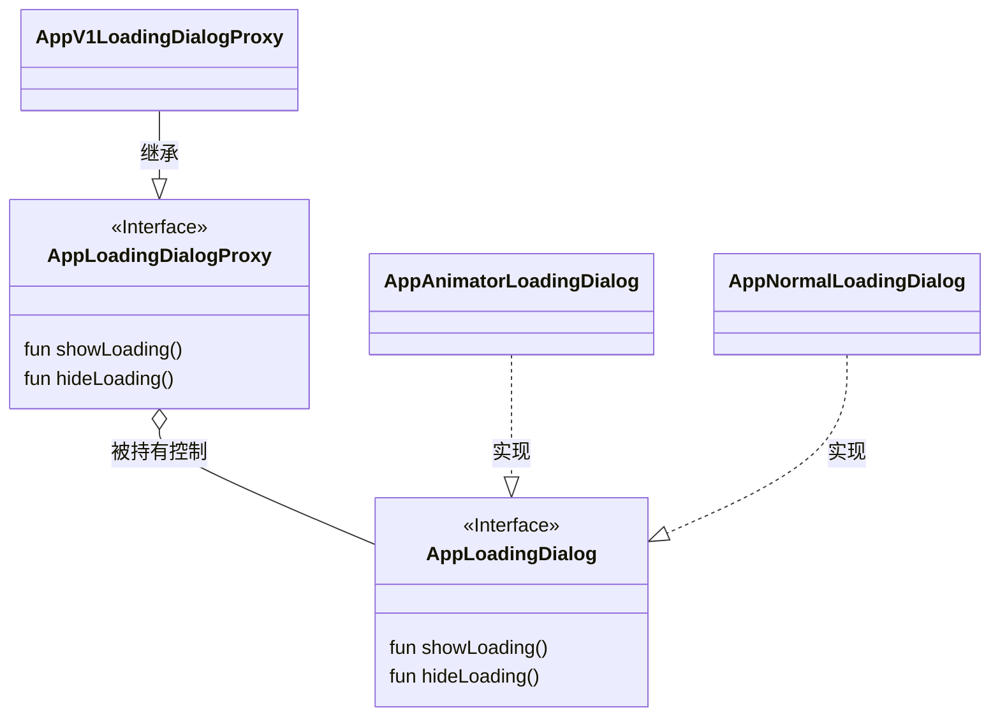

在上述示例图中运用代理模式去进行控制全局的加载显示样式，用来拓展优化版本迭代可替换加载弹窗的功能。

### 外观模式

降低访问复杂系统的内部子系统时的复杂度，简化客户端之间的接口。
```kotlin
interface Shape{
    draw()
}

class Line : Shape{
    
    override draw(){
        print("line draw")
    }
}

class Polygon : Shape{
    
    override draw(){
        print("Polygon draw")
    }
}

class ShapeMaker(){
   
   private val line = Line()
   private val polygon =  Polygon()
    
   fun drawLine() = line.draw()
   fun drawPolygon() = polygon.draw() 
}

fun demo(){
    
    val marker = ShapeMarker()
    
    marker.drawLine()
    marker.drawPolygon()
}
```


**优点：** 减少系统相互依赖。 提高灵活性。 提高了安全性。

**缺点：**不符合开闭原则，如果要改东西很麻烦，继承重写都不合适。

**使用场景：** 为复杂的模块或子系统提供外界访问的模块。 子系统相对独立。 预防低水平人员带来的风险。

**注意事项：**在层次化结构中，可以使用外观模式定义系统中每一层的入口。

### 桥接模式

### 组合模式

又叫部分整体模式，是用于把一组相似的对象当作一个单一的对象。组合模式依据树形结构来组合对象，用来表示部分以及整体层次。这种类型的设计模式属于结构型模式，它创建了对象组的树形结构。

这种模式创建了一个包含自己对象组的类。该类提供了修改相同对象组的方式。可以利用一个公司的人员架构组织来看：

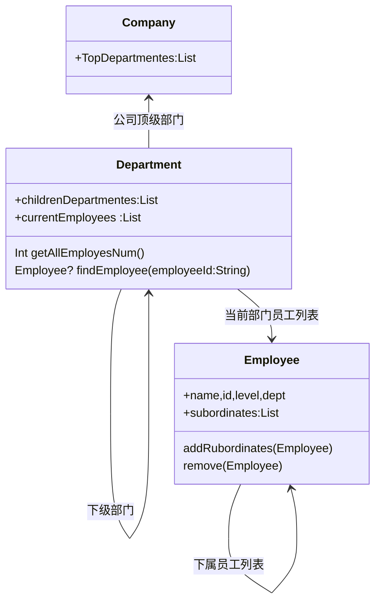

**优点：** 1、高层模块调用简单。 2、节点自由增加。

**缺点：**在使用组合模式时，其叶子和树枝的声明都是实现类，而不是接口，违反了依赖倒置原则。

**使用场景：**部分、整体场景，如树形菜单，文件、文件夹的管理。

**注意事项：**定义时为具体类。

### 享元模式

目的解决创建类的数据。通过抽离共用的细节，当需要用到具有相同细节组合的对象时，优先从内存中取出使用，而当内存中不存在时，则会新建会这一对象保存起来并返回给调用者使用。

```kotlin
interface Shape{
    fun draw()
}

scale class CirecleStatusType{
    
     object SucessType : CirecleStatusType
    
     object ErrorType : CirecleStatusType
    
     object WarringType : CirecleStatusType
}

class Circle (private val  type:CirecleStatusType) : Shape {
   private int x;
   private int y;
   private int radius;
 
   public Circle(String color){
      this.color = color;     
   }
 
   public void setX(int x) {
      this.x = x;
   }
 
   public void setY(int y) {
      this.y = y;
   }
 
   public void setRadius(int radius) {
      this.radius = radius;
   }
 
   @Override
   public void draw() {
      println("Circle: Draw()  type is ${type}, x is${x}, y is${y}, radius is${radius}")
   }
}

class ShapeFactory {
    
    companion object{
        private val circleMap = new HashMap<CirecleStatusType,Shape>()
        
        fun getCircle(type:CirecleStatusType):Shape{
            
            var shape = circleMap[type]
            
            if(shape != null)
            	return shape
            
            shape = Circle(type)
            circleMap[type] = shape
            return shape
        }
    }
}

fun demo(){
    
    for(index in 0..20 ){
        
        val value = index%3
        
       val circle : Circle =  when(value){
            0->{
                return@when Circle(SucessType) 
            }
            1->{
                return@when Circle(ErrorType) 
            }
            2->{
                return@when Circle(WarringType) 
            }
           else->{return@when Circle(SucessType) }
        }
      
         circle.setX(getRandomX())
         circle.setY(getRandomY())
         circle.setRadius(100)
         circle.draw()
    } 
}

private  fun getRandomX():Int {
      return (int)(Math.random()*100 );
}
private  fun getRandomY():int {
      return (int)(Math.random()*100);
}
```

## 行为模式

### 策略模式

策略模式可以这样理解，在一套算法工具中，根据你选择不同算法，基于你同样的入参输出不同的算法结果。

如下图：

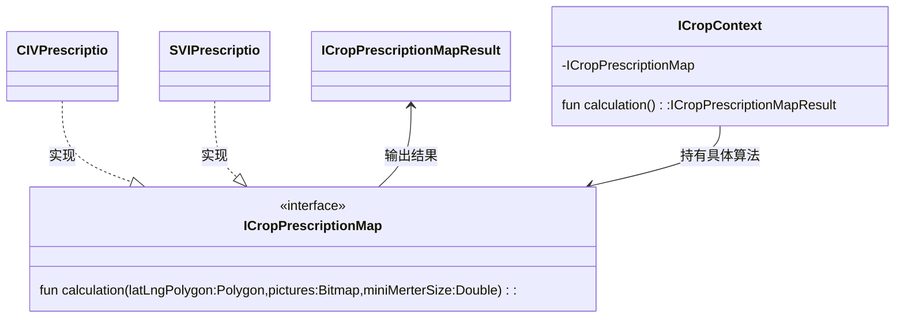

**优点：** 

- 算法可以自由切换。
-  避免使用多重条件判断。
- 扩展性良好。

**缺点：** 

- 策略类会增多。

- 所有策略类都需要对外暴露。

**注意事项：**如果一个系统的策略多于四个，就需要考虑使用混合模式，解决策略类膨胀的问题。

### 模板模式

模板模式顾名思义就是将一个抽象对象（类），具有一定的方法结构，子类通过继承实现其方法结构，每个方法结构看出是每一个步骤，子类通过实现这些步骤去实现相应的功能。譬如运用模板代码完成  加载游戏 玩游戏 结束游戏的游戏控制模板，甚至也可以完成一些硬件固件升级的模板代码。

**优点：** 1、封装不变部分，扩展可变部分。 2、提取公共代码，便于维护。 3、行为由父类控制，子类实现。

**缺点：**每一个不同的实现都需要一个子类来实现，导致类的个数增加，使得系统更加庞大。

**使用场景：** 1、有多个子类共有的方法，且逻辑相同。 2、重要的、复杂的方法，可以考虑作为模板方法。

**注意事项：**为防止恶意操作，一般模板方法都加上 final 关键词。

### 观察者模式

在对象空间内，基于一种一对多的数据依赖模式，当其数据发生变化时候可以，及时通知依赖该数据的对象进行自动更新。

### 责任链模式

责任链模式为请求创建了一个接收者对象的链。这种模式给予请求的类型，对请求的发送者和接收者进行解耦。这种类型的设计模式属于行为型模式。(代码关系是链式，数据传递链式传递，谁合适谁使用)

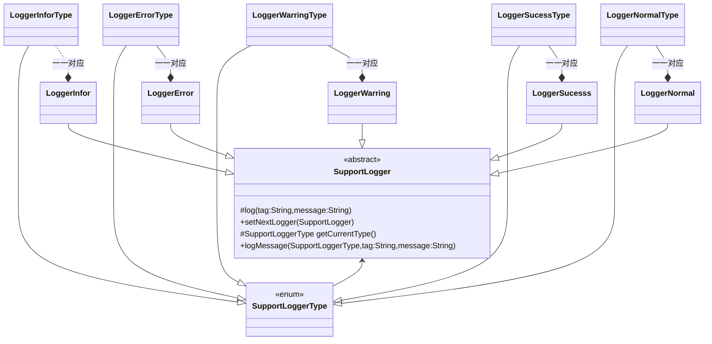

```kotlin
abstract class SupportLogger{
    
    protected abstract fun getSupportLoggerType():SupportLoggerType
    
    protected var nextLogger : SupportLogger?=null
    
    protected abstract fun logMessage(tag:String,message:String)
    
    open fun logMessage(type:SupportLoggerType,tag:String,message:String){
        
        if(getSupportLoggerType == type){
            logMessage(message)
        }
        
        nextLogger?.logMessage(type,message)
    }
    
    fun setNextLogger(next:SupportLogger){
        nextLogger = next
    }
    
}

class LoggerInfo{
    
    override protected fun getSupportLoggerType() = LoggerInfoType
    
    override protected  fun logMessage(tag:String,message:String) { 
        Log.e(tag,message)
        //这里还可以拓展写入数据到文件 或者日志系统 等                                                          
    }
}

class LoggerError{
    
    override protected fun getSupportLoggerType() = LoggerErrorType
    
    override protected  fun logMessage(tag:String,message:String) { 
        Log.e(tag,message)
        //这里还可以拓展写入数据到文件 或者日志系统 等                                                          
    }
}

class LoggerWarring{
    
    override protected fun getSupportLoggerType() = LoggerWarringType
    
    override protected  fun logMessage(tag:String,message:String) { 
        Log.w(tag,message)
        //这里还可以拓展写入数据到文件 或者日志系统 等                                                          
    }
}

class LoggerSucess{
    
    override protected fun getSupportLoggerType() = LoggerSucessType
    
    override protected  fun logMessage(tag:String,message:String) { 
        Log.i(tag,message)
        //这里还可以拓展写入数据到文件 或者日志系统 等                                                          
    }
}

class LoggerNormal{
    
    override protected fun getSupportLoggerType() = LoggerNormalType
    
    override protected  fun logMessage(tag:String,message:String) { 
        Log.i(tag,message)
        //这里还可以拓展写入数据到文件 或者日志系统 等                                                          
    }
}

scale class SupportLoggerType{
    object class LoggerInfoType
    object class LoggerErrorType
    object class LoggerWarringType
    object class LoggerSucessType
    object class LoggerNormalType
}

fun test(){
    
    val logger = LoggerInfo()
    val sucess = LoggerSucess()
    logger.setNextLogger(sucess)
    logger.logMessage(LoggerSucessType,"login","was sucessed")
}
```

### 迭代器模式

这种模式用于顺序的方式访问集合内的数据元素。最常见的可以参考Iterator，一般关键接口为**hasNext**、**next**两个接口。

**优点：** 

- 它支持以不同的方式遍历一个聚合对象。 
- 迭代器简化了聚合类。 
- 在同一个聚合上可以有多个遍历。 
- 在迭代器模式中，增加新的聚合类和迭代器类都很方便，无须修改原有代码。

**缺点：**由于迭代器模式将存储数据和遍历数据的职责分离，增加新的聚合类需要对应增加新的迭代器类，类的个数成对增加，这在一定程度上增加了系统的复杂性。

**使用场景：** 

- 访问一个聚合对象的内容而无须暴露它的内部表示。 
- 需要为聚合对象提供多种遍历方式。 
- 为遍历不同的聚合结构提供一个统一的接口。

**注意事项：**迭代器模式就是分离了集合对象的遍历行为，抽象出一个迭代器类来负责，这样既可以做到不暴露集合的内部结构，又可让外部代码透明地访问集合内部的数据


### 命令模式

将一个请求封装成一个对象，从而使您可以用不同的请求对客户进行参数化。

可以利用客户通过股票经济人去买卖股票一样方式去理解。

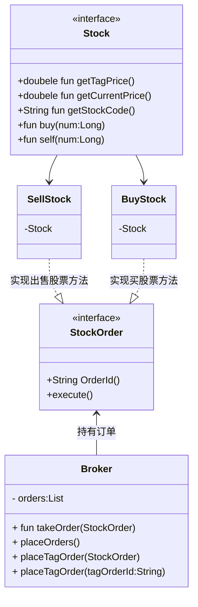

**优点：** 

- 降低了系统耦合度。
- 新的命令可以很容易添加到系统中去。

**缺点：**使用命令模式可能会导致某些系统有过多的具体命令类。

**使用场景：**认为是命令的地方都可以使用命令模式，比如： 

- GUI 中每一个按钮都是一条命令。 
- 模拟 CMD。

**注意事项：**系统需要支持命令的撤销(Undo)操作和恢复(Redo)操作，也可以考虑使用命令模式，见命令模式的扩展。

### 备忘录模式

备忘录模式可以这样理解，备份保存对象内的数据。再合适的提供给用户选择是否恢复（也就是游戏存档，玩家可否选择回档）。

**应用实例：** 

- 后悔药。 
- 打游戏时的存档。
- Windows 里的 ctrl + z。 
- IE 中的后退。 
- 数据库的事务管理。

**优点：** 

	- 给用户提供了一种可以恢复状态的机制，可以使用户能够比较方便地回到某个历史的状态
	- 实现了信息的封装，使得用户不需要关心状态的保存细节

**缺点：**消耗资源。如果类的成员变量过多，势必会占用比较大的资源，譬如保存在内存中则消耗内存资源，保存在磁盘中则消耗磁盘资源

**使用场景：** 需要保存/恢复数据的相关状态场景；提供一个可回滚的操作。

**注意事项：** 为了符合迪米特原则，还要增加一个管理备忘录的类；为了节约内存，可使用原型模式+备忘录模式、也可以采用保存在磁盘中方式。

### 状态模式

在状态模式中，我们创建表示各种状态的对象和一个行为随着状态对象改变而改变的上下文对象(Context).简单来说就是上下文对象的状态变化是有state发生变化而变化、。

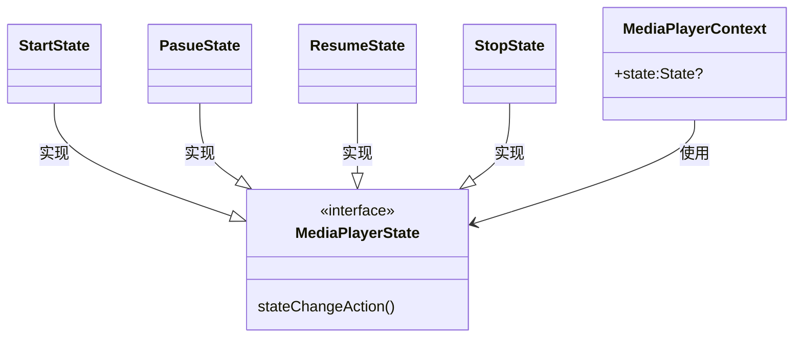

**优点：** 

- 封装了转换规则。 
- 枚举可能的状态，在枚举状态之前需要确定状态种类。 
- 将所有与某个状态有关的行为放到一个类中，并且可以方便地增加新的状态，只需要改变对象状态即可改变对象的行为。
- 允许状态转换逻辑与状态对象合成一体，而不是某一个巨大的条件语句块。 
- 可以让多个环境对象共享一个状态对象，从而减少系统中对象的个数。

**缺点：** 

- 状态模式的使用必然会增加系统类和对象的个数。
- 状态模式的结构与实现都较为复杂，如果使用不当将导致程序结构和代码的混乱。 
- 状态模式对"开闭原则"的支持并不太好，对于可以切换状态的状态模式，增加新的状态类需要修改那些负责状态转换的源代码，否则无法切换到新增状态，而且修改某个状态类的行为也需修改对应类的源代码。

**使用场景：** 行为随状态改变而改变的场景。 条件、分支语句的代替者。


```kotlin

class MediaPlayerContext{
    
    var state :MediaPlayerState?= null

}

interface MediaPlayerState{
    fun stateChangeAction(context:MediaPlayerContext)
}

class StartState :MediaPlayerState{
    
    override fun  stateChangeAction(context:MediaPlayerContext){
        
        val currentState = context.state
        
        if(currentState is MediaPlayerState){
            return
        }
        
        println("state change by StartState")
        
        context.state  = this
    }
    
    override toString():String = "StartState"
}
	
class PasueState :MediaPlayerState{
    
    override fun  stateChangeAction(context:MediaPlayerContext){
        
        val currentState = context.state
        
        if(currentState is PasueState){
            return
        }
        
        println("state change by PasueState")
        
        context.state  = this
    }
    
    override toString():String = "PasueState"
}

class ResumeState :MediaPlayerState{
    
    override fun  stateChangeAction(context:MediaPlayerContext){
        
        val currentState = context.state
        
        if(currentState is ResumeState){
            return
        }
        
        println("state change by ResumeState")
        
        context.state  = this
    }
    
    override toString():String = "ResumeState"
}

class StopState :MediaPlayerState{
    
    override fun  stateChangeAction(context:MediaPlayerContext){
        
        val currentState = context.state
        
        if(currentState is StopState){
            return
        }
        
        println("state change by StopState")
        
        context.state  = this
    }
    
    override toString():String = "StopState"
}

fun test(){
    
    val conetext = MediaPlayerContext()
    val startState = StartState()
    
    startState.stateChangeAction(context)
    
    val stopState = StartState()
    stopState.stateChangeAction(context)
    
}
```

### 访问者模式

在访问者模式（Visitor Pattern）中，我们使用了一个访问者类，它改变了元素类的执行算法。通过这种方式，元素的执行算法可以随着访问者改变而改变。这种类型的设计模式属于行为型模式。根据模式，元素对象已接受访问者对象，这样访问者对象就可以处理元素对象上的操作。


### 中介者模式

中介者模式（Mediator Pattern）是用来降低多个对象和类之间的通信复杂性。这种模式提供了一个中介类，该类通常处理不同类之间的通信，并支持松耦合，使代码易于维护。中介者模式属于行为型模式。

参考直播间中多个用户在同一个直播房间内发送弹幕信息。

```kotlin
object class LiveTelecastRoom{
    
    fun receiveBarrage(roomId:String,barrageData:BarrageData){
        //这里做接收弹幕的逻辑并显示正确的UI
    }
}

class BarrageData{
    String message
    BarrageStyle style
}

class User{
    
   fun sendBarrage(roomId:String,data:BarrageData){
       LiveTelecastRoom.receiveBarrage(roomId,data)
   }
}

fun test(){
    
    val userList = ArrayList<User>()
    
    userList.forEach{userItem->
        userItem.sendBarrage("xxxxx",BarrageData())
    }
}

  
```

**何时使用：**多个类相互耦合，形成了网状结构。

**如何解决：**将上述网状结构分离为星型结构。

**关键代码：**对象 Colleague 之间的通信封装到一个类中单独处理。

**应用实例：** 

- 中国加入 WTO 之前是各个国家相互贸易，结构复杂，现在是各个国家通过 WTO 来互相贸易。
-  机场调度系统。
-  MVC 框架，其中C（控制器）就是 M（模型）和 V（视图）的中介者。

**优点：** 

- 降低了类的复杂度，将一对多转化成了一对一。 
- 各个类之间的解耦。 3、符合迪米特原则。

**缺点：**中介者会庞大，变得复杂难以维护。

**注意：**中介模式与代理模式区别在于：中介模式可以一对多呈现星型结构，代理模式必须一对一。

### 解释器模式

解释器模式（Interpreter Pattern）提供了评估语言的语法或表达式的方式，它属于行为型模式。这种模式实现了一个表达式接口，该接口解释一个特定的上下文。这种模式被用在 SQL 解析、符号处理引擎等。

例如在硬件通信中，譬如IOT通讯中，通过定义一套数据传递规则，利用注解生成对应关键规则，然后通过不断反注解不断拼接生成对应数据传输到相应的硬件内程序中进行通信。

**关键代码：**构建环境类，包含解释器之外的一些全局信息，一般是 HashMap。

**应用实例：**编译器、运算表达式计算。

**优点：** 

- 可扩展性比较好，灵活。
- 增加了新的解释表达式的方式。 3、易于实现简单文法。

**缺点：** 

- 可利用场景比较少。
-  对于复杂的文法比较难维护。 
- 解释器模式会引起类膨胀。 
- 解释器模式采用递归调用方法。

**使用场景：**

-  可以将一个需要解释执行的语言中的句子表示为一个抽象语法树。
-  一些重复出现的问题可以用一种简单的语言来进行表达。 3、一个简单语法需要解释的场景。

**注意事项：**可利用场景比较少，JAVA 中如果碰到可以用 expression4J 代替。

